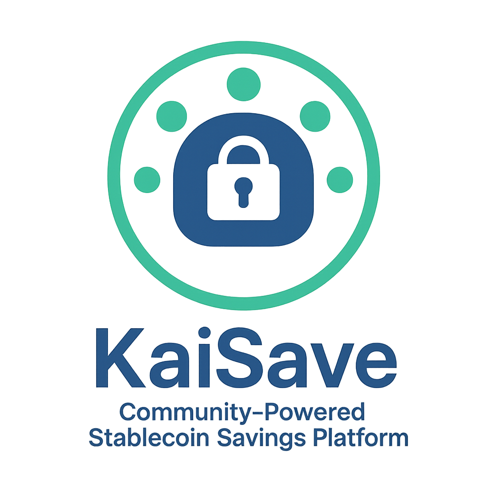

# KaiSave – Community-Powered Stablecoin Savings Platform

## 🚀 Vision
In many parts of the world, especially in Africa and Asia, millions of people lack access to reliable savings and stable returns. Traditional banks offer very low interest rates, while crypto is often too volatile and complex. Informal rotating savings groups (*ajo, esusu, chit funds*) are popular but prone to fraud and lack transparency.

**KaiSave** bridges this gap by building on the **Kaia blockchain** with USDT:

- **Stable Yield Vaults** – deposit USDT and earn safe passive income.
- **KaiCircles (Rotating Savings)** – blockchain-powered community savings circles with fairness and transparency.
- **Loyalty Rewards** – incentives for consistent savers.
- **Cross-Border Remittances** – send USDT directly into savings instead of cash transfers.

---

## 🔧 Features
- On-chain **stablecoin vaults** (Solidity smart contracts).
- Automated **rotating group savings** with transparent payouts.
- Simple, mobile-first interface for emerging markets.
- Scalable for families, communities, and cooperatives.

---

## 📦 Tech Stack
- **Blockchain**: Kaia (EVM-compatible)
- **Smart Contracts**: Solidity
- **Frontend**: React / Next.js (planned)
- **Backend**: Node.js (planned)

---

## 📹 Demo (Coming Soon)
We’ll publish a short video showing the KaiSave experience.

---

## 🤝 Contribution
We welcome contributors! Please fork this repo, make improvements, and open a PR.

---

## 📜 License
This project is licensed under the MIT License - see the [LICENSE](LICENSE) file for details.
